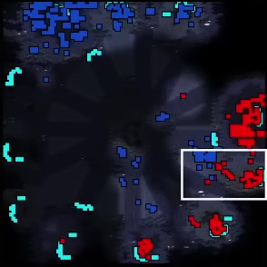
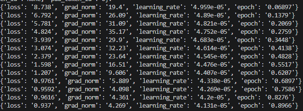
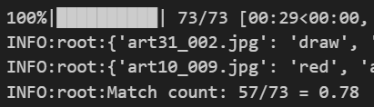

# JANGGOON - Strategy Model

## 0. Environment Setup
For now, the requirements.txt and environment setup is tailored to a WSL2 Linux Environment, optimized for the NVIDIA RTX 3070 GPU with a CUDA 12.4 runtime.

```bash
conda create -n JANGGOON python=3.13 -y
conda activate JANGGOON
pip install -r requirements.txt
```
### Running JANGGOON Pipeline (Data Scraping/Processing --> Training/Validation --> Inference/Test)

Use [`image_caption_extraction.py`](./image_caption_extraction.py) to... 
- download youtube videos with yt-dlp
- crop images from those videos and sample them with ffmpeg
- generate image caption file that will need to be human-annotated

Use [`JANGGOON_model.py`](./JANGGOON_model.py) to...
- run inference with any HuggingFace Image-Captioning model you want (I used BLIP and GIT but it should for others with minimal changes.)
- finetune-train any HF Image Captioning Model to make tactical analysis captions
- test finetune-trained model's tactical judgement and analysis capabilities


## 1. Introduction
JANGGOON is a deep learning model trained to assess strategic outcomes of scenes (in video games for now). This work was inspired by <a href="https://www.science.org/doi/10.1126/science.ade9097">CICERO</a> and <a href="https://arxiv.org/abs/2312.11865">LLMs play sc2</a>. It started as an experiment with the pretrained capabilities of image captioning models to see if they could make accurate tactical judgements given one or more scenes. This specific experiment involved an image-captioning model inferring a caption given an image that declared the winning player color, followed by an explanation of the scene (see example below).

<div style="display: flex; justify-content: center; gap: 20px;">
  <div style="text-align: center;">
    
    <p><em>Sample Frame</em></p>
  </div>
  <div style="text-align: center;">
    
    <p><em>Sample Caption</em></p>
  </div>
</div>

## 2. Data Pipeline
My data pipeline consists of starcraft youtube video downloads from yt-dlp which feeds into image sampling and cropping using ffmpeg. I sample one image per minute (1/60 fps) as 1 frame very roughly describes the tactical state of the minimap for a minute. This choice was made primarily because I chose to use human annotation or human experts to annotate the data. Consequently, I had to limit the amount of data as our annotation team was myself and one other. Starcraft has what is known as a "minimap" in the bottom left of the game view. This cropped out minimap of each frame is what I used as my image data. I then generate a .json caption file that stores a dictionary with image_id as the key and the actual caption as the value. In order to enable tactical judgement evaluation, the captions were structured to start with "Winner. Followed by the rest of the caption."


## 3. Training and Validation
I did an 80-10-10 train-val-test split on my image-caption pairs. I then trained the BLIPConditionalGeneration model with the HuggingFace Trainer. This model was trained with an image-conditioned autoregressive cross-entropy loss. What this means is that the model has a "vocabulary" of a large amount of tokens (30,000 for example) and after seeing an image and the tokens before, it assigns a probability distribution across all tokens in its vocab on what is most likely to be the next token in the sequence. During training the loss then compares the probability assigned to the "correct" token and optimizes as it wants the probability to be as close to 100% as possible. So for example if it assigns a probability of 0.9 to token A and token A was the true next token (1.0), then the loss would be low 1.0 - 0.9, vice versa if token A was not the true next token (0) then the loss would be high 0-0.9.

<div align="center">
  
  
  <p><em>Train-Validation Loss Curves (validation only starts after the first epoch)</em></p>
</div>

## 4. Evaluation
I evaluated the % of correct tactical judgement from BLIP by parsing the caption string, and creating a list of just the winner prediction before the ".". I then compared this list against the same list from the actual captions. JANGGOON successfully identifies the "winning player color" 80% of the time across multiple test trials with the test dataset which JANGGOON had not been trained on.
<div style="text-align:center">
  
  
  <p><em>blip-base vs blip-finetuned caption inference results</em></p>
</div>
<div style="text-align: center;">
  
  <p><em>JANGGOON Tactical Judgement Accuracy</em></p>
</div>